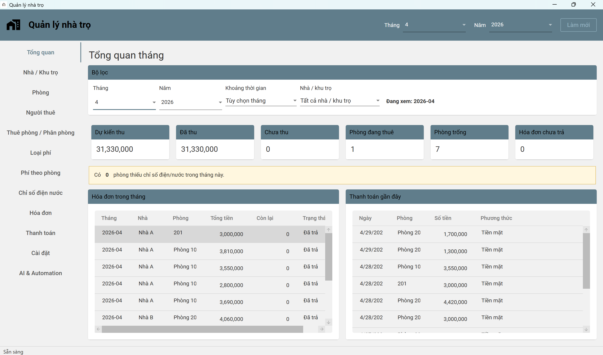
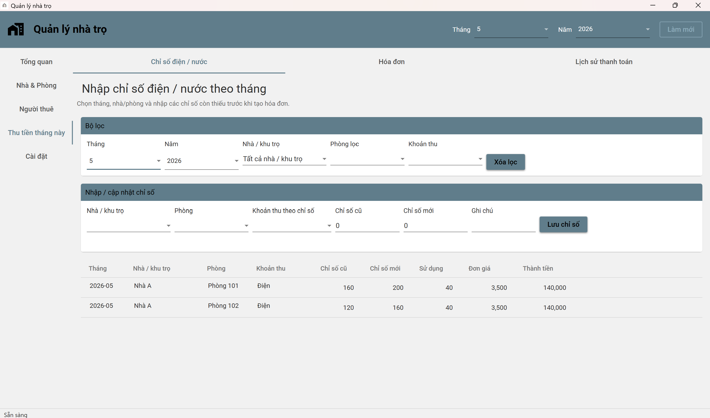
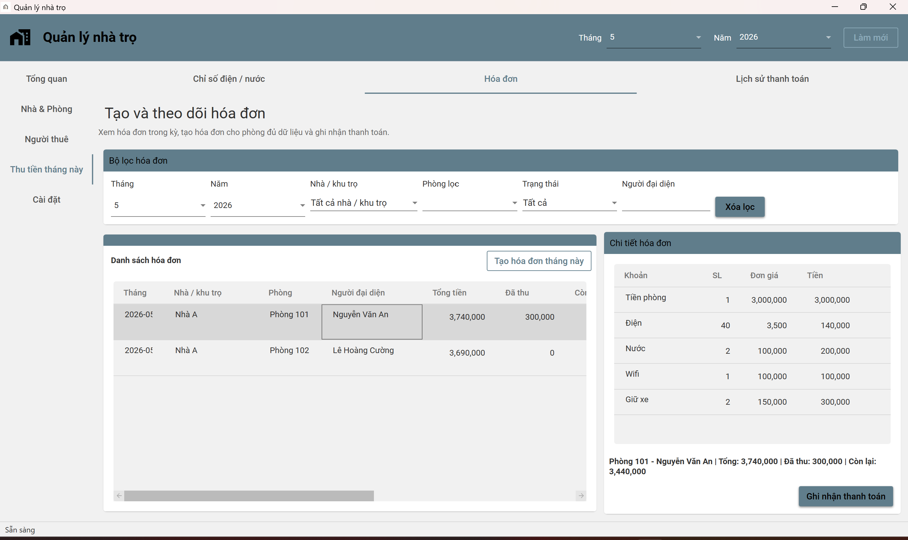
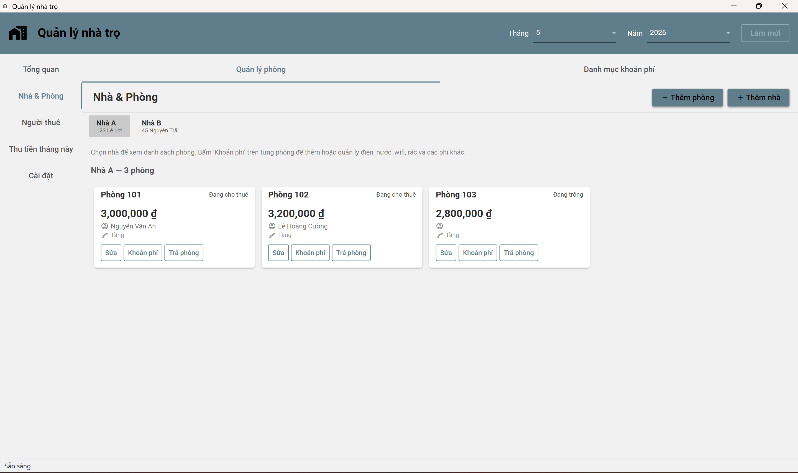
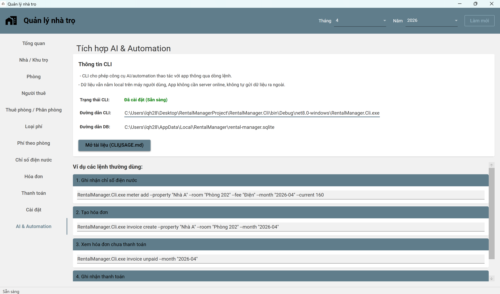

# RentalManager 🏠

**RentalManager** là ứng dụng desktop hỗ trợ chủ trọ quản lý nhà/phòng, người thuê, chỉ số điện nước, hóa đơn, thanh toán và sao lưu dữ liệu trong một giao diện đơn giản, dễ tiếp cận.

Mục tiêu của RentalManager không phải là thay thế toàn bộ các hệ thống quản lý cho thuê chuyên nghiệp, mà là tạo ra một công cụ **gọn, dễ dùng, ít rối hơn nhiều website quản lý**, phù hợp với chủ trọ nhỏ hoặc cá nhân muốn tự quản lý dữ liệu trên máy của mình.

Ứng dụng được xây dựng bằng **WPF (.NET 8)**, dùng **SQLite** để lưu dữ liệu và có thêm **CLI** cho người dùng nâng cao muốn tự kết nối công cụ automation/AI bên ngoài như OpenClaw.

---

## Điểm nổi bật trong phiên bản hiện tại

### 1. Giao diện quản lý dễ tiếp cận

RentalManager tập trung vào luồng thao tác thực tế của chủ trọ thay vì chia giao diện quá kỹ theo bảng dữ liệu. Các nhóm chức năng chính gồm:

- **Tổng quan:** xem nhanh doanh thu, công nợ, phòng đang thuê, phòng trống, hóa đơn còn nợ và tình trạng thiếu chỉ số.
- **Nhà & Phòng:** quản lý khu trọ, phòng và các khoản phí áp dụng cho từng phòng.
- **Người thuê:** lưu thông tin người thuê, phân phòng và theo dõi trạng thái thuê.
- **Thu tiền tháng này:** nhập chỉ số điện/nước, tạo hóa đơn, ghi nhận thanh toán và xem lịch sử thanh toán.
- **Cài đặt:** quản lý dữ liệu, sao lưu, khôi phục, tạo dữ liệu mẫu và automation CLI.

### 2. Dashboard tháng và năm

Dashboard hiện hỗ trợ:

- Tổng quan theo tháng.
- Tổng quan theo năm.
- Các chỉ số chính như dự kiến thu, đã thu, chưa thu và hóa đơn còn nợ.
- Bảng tóm tắt theo tháng để dễ nhìn tình hình doanh thu trong năm.

### 3. Quản lý phí linh hoạt

Ứng dụng hỗ trợ nhiều loại phí thường gặp trong nhà trọ:

- Điện.
- Nước.
- Wifi.
- Gửi xe.
- Rác.
- Khoản phí khác.

Có thể dùng giá mặc định hoặc cấu hình riêng theo từng phòng. Các khoản phí theo chỉ số, phí cố định, phí theo người và phí theo đơn vị được xử lý trong luồng tạo hóa đơn.

### 4. Chỉ số điện/nước và hóa đơn

RentalManager hỗ trợ:

- Nhập hoặc cập nhật chỉ số điện/nước theo tháng.
- Tự tính lượng sử dụng và tiền phí.
- Tạo hóa đơn theo phòng.
- Tạo hàng loạt hóa đơn cho các phòng đủ dữ liệu.
- Chống tạo trùng hóa đơn.
- Ghi nhận thanh toán toàn phần hoặc một phần.
- Theo dõi hóa đơn còn nợ.

### 5. Sao lưu và khôi phục dữ liệu

Ứng dụng có sẵn các thao tác dữ liệu cơ bản:

- Mở thư mục dữ liệu.
- Tạo bản sao lưu.
- Mở thư mục sao lưu.
- Khôi phục từ bản sao lưu.
- Tự tạo bản sao lưu an toàn trước khi khôi phục.
- Xóa toàn bộ dữ liệu hiện tại để bắt đầu lại sau khi test hoặc tạo dữ liệu mẫu.

### 6. CLI cho automation bên ngoài

RentalManager đi kèm `RentalManager.Cli`, cho phép công cụ bên ngoài thao tác với dữ liệu app qua dòng lệnh.

CLI phù hợp cho người dùng nâng cao muốn tự thiết lập automation hoặc AI agent bên ngoài. Ứng dụng **không tích hợp AI sẵn**; CLI chỉ đóng vai trò là lớp điều khiển để công cụ khác có thể gọi lệnh, nhận JSON output và quyết định bước tiếp theo.

Tài liệu chi tiết: [docs/CLI_USAGE.md](docs/CLI_USAGE.md)

---

## Hình ảnh giao diện

### Tổng quan



### Nhập chỉ số điện/nước



### Hóa đơn và thanh toán



### Phí áp dụng cho phòng



### AI & Automation CLI



---

## Cài đặt và sử dụng

### Yêu cầu hệ thống

- Windows 10/11 64-bit.
- Nếu dùng bản release self-contained, không cần cài thêm .NET Runtime.
- Nếu build từ mã nguồn, cần .NET 8 SDK/Desktop Runtime.

### Tải bản phát hành

1. Vào mục **Releases** trên GitHub.
2. Tải file `.zip` của phiên bản mới nhất.
3. Giải nén.
4. Chạy `RentalManager.exe`.

### Build từ mã nguồn

```bash
dotnet build RentalManager.sln -c Release
```

Chạy ứng dụng WPF:

```bash
dotnet run --project RentalManager/RentalManager.csproj -c Release
```

Chạy CLI:

```bash
dotnet run --project RentalManager.Cli/RentalManager.Cli.csproj -- invoice unpaid --month "2026-05"
```

---

## Ví dụ sử dụng CLI

Tạo hóa đơn:

```bash
RentalManager.Cli.exe invoice create --property "Nhà A" --room "Phòng 101" --month "2026-05"
```

Xem hóa đơn chưa thanh toán:

```bash
RentalManager.Cli.exe invoice unpaid --month "2026-05"
```

Nhập chỉ số điện:

```bash
RentalManager.Cli.exe meter add --property "Nhà A" --room "Phòng 101" --fee "Điện" --month "2026-05" --current 150
```

Ghi nhận thanh toán:

```bash
RentalManager.Cli.exe payment add --invoice 12 --amount 300000 --method "Tiền mặt"
```

CLI trả về JSON để người dùng, script hoặc agent bên ngoài có thể đọc kết quả rõ ràng.

---

## Kiến trúc kỹ thuật

RentalManager được xây dựng theo hướng WPF/MVVM với service layer dùng chung cho giao diện desktop và CLI.

### Công nghệ chính

- **UI:** WPF.
- **Pattern:** MVVM.
- **Ngôn ngữ:** C# / .NET 8.
- **Database:** SQLite.
- **ORM:** Entity Framework Core.
- **CLI:** Console app dùng chung service/business logic.

### Cấu trúc chính

- **Models:** định nghĩa entity và dữ liệu nghiệp vụ.
- **Services:** xử lý logic chính như phòng, người thuê, hóa đơn, thanh toán, sao lưu và dữ liệu mẫu.
- **ViewModels:** kết nối UI với service, xử lý command và trạng thái màn hình.
- **WPF Views/XAML:** giao diện người dùng.
- **CLI:** nhận tham số dòng lệnh, gọi service và trả JSON output.

Kiến trúc này giúp logic nghiệp vụ được tập trung ở service layer, hạn chế việc viết lại logic giữa WPF và CLI.

---

## Những hạn chế hiện tại

RentalManager hiện vẫn là một app desktop đang phát triển, nên còn một số điểm chưa có:

- **Chưa có quản lý hợp đồng thuê phòng**: hiện app tập trung vào phòng, người thuê, phân phòng, chỉ số, hóa đơn và thanh toán. Chưa có module tạo/lưu hợp đồng, thời hạn hợp đồng, phụ lục hoặc file hợp đồng.
- **Chưa tự tạo QR thanh toán theo ngân hàng**: người dùng vẫn cần tự xử lý QR/chuyển khoản bên ngoài.
- **Chưa có import/export Excel**: chưa hỗ trợ nhập dữ liệu phòng/người thuê/hóa đơn từ Excel hoặc xuất báo cáo Excel.
- **Chưa có bản web/mobile online**: app hiện là desktop/offline. Nếu muốn truy cập từ xa, người dùng phải tự thiết lập giải pháp riêng như remote desktop, VPS, hoặc automation qua CLI/OpenClaw theo cách của họ.
- **Chưa có quản lý nhiều tài khoản/người dùng**: phù hợp hơn với một chủ trọ hoặc một máy quản lý chính.
- **Chưa có báo cáo thuế/kế toán chuyên sâu**: dashboard hiện hỗ trợ xem số liệu vận hành và doanh thu cơ bản, chưa phải hệ thống kế toán đầy đủ.
- **CLI chưa bao phủ toàn bộ chức năng trong app**: CLI hiện tập trung vào một số workflow chính như chỉ số, hóa đơn và thanh toán.

---

## Khả năng mở rộng trong tương lai

Các hướng phát triển có thể bổ sung sau:

### Quản lý hợp đồng

- Lưu thông tin hợp đồng thuê.
- Theo dõi ngày bắt đầu, ngày kết thúc, đặt cọc và điều khoản.
- Cảnh báo hợp đồng sắp hết hạn.
- Gắn file hợp đồng hoặc mẫu hợp đồng.

### QR thanh toán và ngân hàng

- Tạo QR thanh toán theo ngân hàng.
- Gắn nội dung chuyển khoản theo hóa đơn.
- Hỗ trợ kiểm tra/gợi ý đối soát thanh toán nếu có nguồn dữ liệu phù hợp.

### Excel và báo cáo

- Import danh sách phòng/người thuê từ Excel.
- Export hóa đơn, thanh toán, công nợ và báo cáo năm.
- Tạo mẫu báo cáo phù hợp cho chủ trọ nhỏ.

### Online/Web version

- Tách service layer thành Web API.
- Chuyển database sang SQL Server/PostgreSQL nếu cần nhiều người dùng.
- Thêm authentication/authorization.
- Hỗ trợ truy cập từ nhiều thiết bị.

### Automation/AI nâng cao

- Mở rộng CLI command coverage.
- Thêm lệnh list/search/status để external AI agent dễ thao tác hơn.
- Chuẩn hóa JSON contract và error codes.
- Hỗ trợ tốt hơn cho workflow qua OpenClaw hoặc automation framework khác.

### Backup và dữ liệu

- Lịch backup tự động.
- Tùy chọn thư mục backup.
- Cảnh báo khi lâu chưa sao lưu.
- Import/export dữ liệu để chuyển máy dễ hơn.

---

## Phù hợp với ai?

RentalManager phù hợp với:

- Chủ trọ nhỏ hoặc cá nhân quản lý vài khu/phòng.
- Người muốn dùng app desktop gọn, không phụ thuộc website phức tạp.
- Người muốn tự kiểm soát dữ liệu trên máy.
- Người cần quản lý điện nước, hóa đơn và thanh toán hằng tháng.
- Người dùng nâng cao muốn tự gắn automation hoặc AI agent bên ngoài qua CLI.

RentalManager chưa phù hợp nếu bạn cần ngay một hệ thống online nhiều tài khoản, hợp đồng đầy đủ, QR ngân hàng tự động, import/export Excel hoàn chỉnh hoặc quy trình kế toán/thuế chuyên sâu.

---

## Trạng thái phiên bản

Phiên bản hiện tại hướng tới **v0.2.0**, tập trung cải thiện UI/UX, dashboard, hóa đơn, CLI automation UX và dữ liệu/sao lưu.

Các phần chính đã được cải thiện:

- Dashboard tháng/năm.
- Hóa đơn và thao tác thanh toán nhanh hơn.
- Modal tạo hóa đơn dễ thao tác hơn.
- CLI output rõ hơn cho automation bên ngoài.
- Backup/restore an toàn hơn.
- Xóa toàn bộ dữ liệu để bắt đầu lại sau khi test.

---

## Ghi chú phát triển

Đây là project đang phát triển theo hướng thực dụng: ưu tiên luồng dùng thật, giảm thao tác rối và hạn chế mở rộng quá sớm. Những tính năng lớn như hợp đồng, QR ngân hàng, Excel, cloud sync hoặc web version sẽ được xem xét theo từng giai đoạn sau.
